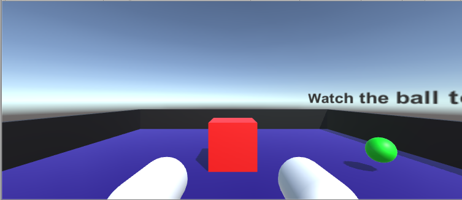

# Cardboard-game-unity

*Cardboard game* is a project make in Unity with Google VR.

## Requirements
You only can play in Android(MIN. 19+) or greater.
If you want to play in your computer, use the project and play in mode Editor.

## Screenshot

## Acknowledgments
Google VR: [Google VR](https://github.com/googlevr/gvr-unity-sdk/releases)

Unity: [Docs Unity](https://docs.unity3d.com/2018.4/Documentation/Manual/index.html)

Tutorial: [Youtube playlist](https://www.youtube.com/watch?v=OEP7sMwfZnE&list=PLiuDBLn1FK-QOmpA3Vs2JY0DVAj0GfFPn)
